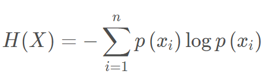
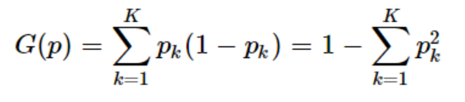
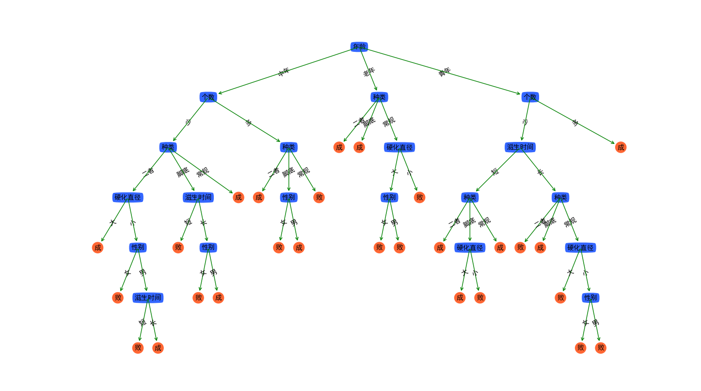
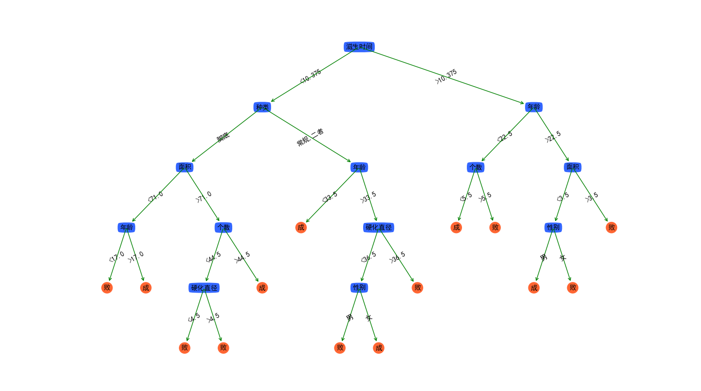
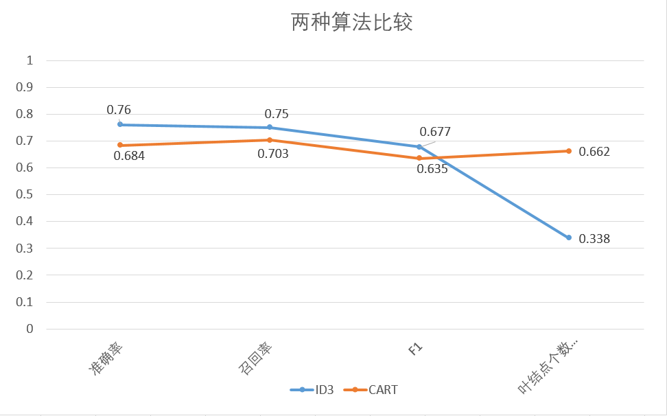

# 决策树算法比较研究

## 1. 数据集介绍
   - **剖腹产分类数据集**(Caesarian Section Classification Dataset)
     - 数据集特征：单变量
     - 相关任务：分类
     - 实例数：80
     - 属性数量：5
     - 属性特征：整数
     - 属性信息：
       - 年龄{22,26,28,27,32,36,33,23,20,29,25,37,24,18,30,40,31,19,21,35,17,38}、
       - 已有孩子的个数{1,2,3,4}、
       - 怀孕时长{0=及时,1=早产,2=晚产}、
       - 血压{0=低,1=正常,2=高}、
       - 是否患过心脏病{0=患过,1=未患过}
   - **冷冻疗法数据集**(Cryotherapy Dataset)
     - 数据集特征：单变量
     - 相关任务：分类
     - 实例数：90
     - 属性数量：6
     - 属性特征：整数，实数
     - 属性信息：
       - 性别{1=男,2=女}
       - 年龄{15-67}、
       - 瘊子的滋生时间(月){0.25-12}
       - 瘊子的个数{1-12}
       - 患病种类{1=常规,2=脚底,3=二者均有}
       - 瘊子的大小(mm){4-750}
   - **免疫疗法数据集**(Immunotherapy Dataset)
     - 数据集特征：单变量
     - 相关任务：分类
     - 实例数：90
     - 属性数量：7
     - 属性特征：整数，实数
     - 属性信息：
       - 性别{1=男,2=女}
       - 年龄{15-54}、
       - 瘊子的滋生时间(月){1-12}
       - 瘊子的个数{1-19}
       - 患病种类{1=常规,2=脚底,3=二者均有}
       - 瘊子的大小(mm){6-900}
       - 硬化直径(mm){2-70}

## 2. 理论依据
ID3算法：根据信息熵和信息增益计算每轮划分的最佳属性

CART算法：依照Gini指数计算每轮二分类的最佳属性

## 3. 实验结果及评价
ID3算法评估

ID3算法评估

两种算法相比较
